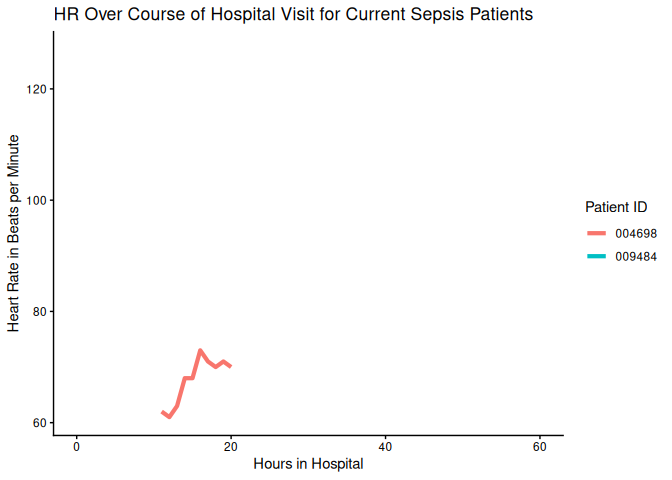
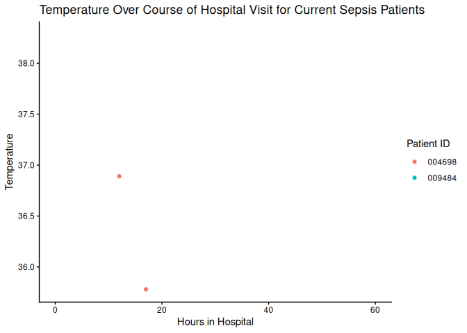

# Sepsis Data Report

## Sepsis Patient Information

### Data last updated: 2025-04-03 18:35:40

#### Current Vitals for Patients with Sepsis

| PatientID | Hours in Hospital | Heart Rate | Temperature | Respiratory Rate |
|:----------|------------------:|-----------:|------------:|-----------------:|
| 009484    |                94 |         94 |          NA |               24 |
| 004698    |                20 |         70 |          NA |               14 |

#### Change in Vitals for All Patients

| PatientID | Hours in Hospital | Sepsis | Heart Rate | Temperature | Respiratory Rate | Heart Rate Change | Temperature Change | Respiration Rate Change |
|:---|---:|:---|---:|---:|---:|---:|---:|---:|
| 000313 | 41 | No | 74 | NA | NA | -5 | NA | NA |
| 000335 | 44 | No | 66 | 37.61 | 21 | -8 | NA | 6 |
| 000341 | 23 | No | NA | NA | NA | NA | NA | NA |
| 000470 | 21 | No | 63 | 36.89 | 14 | -4 | NA | 4 |
| 000534 | 19 | No | 98 | NA | 23 | -5 | NA | 8 |
| 000558 | 17 | No | 78 | NA | 26 | 3 | NA | 9 |
| 000673 | 40 | No | 115 | NA | 24 | 24 | NA | 12 |
| 000902 | 42 | No | 90 | 37.28 | 15 | 7 | NA | -3 |
| 001083 | 57 | No | 67 | NA | 17 | 0 | NA | -1 |
| 001282 | 39 | No | NA | NA | NA | NA | NA | NA |
| 001309 | 20 | No | 82 | 36.78 | 8 | 1 | NA | 1 |
| 001545 | 45 | No | 99 | NA | 18 | 5 | NA | -5 |
| 001749 | 42 | No | 65 | NA | 14 | -11 | NA | -4 |
| 001772 | 32 | No | NA | NA | NA | NA | NA | NA |
| 002006 | 34 | No | 70 | NA | 15 | 0 | NA | 0 |
| 002320 | 36 | No | 60 | 37.56 | 14 | 0 | NA | 0 |
| 002444 | 50 | No | 52 | NA | 16 | 0 | NA | 3 |
| 002484 | 29 | No | 61 | NA | 19 | -2 | NA | 1 |
| 003032 | 18 | No | NA | NA | NA | NA | NA | NA |
| 003371 | 20 | No | 65 | 36.89 | 12 | -4 | NA | -2 |
| 003531 | 31 | No | 84 | NA | 16 | 0 | NA | -3 |
| 003535 | 47 | No | 95 | NA | 25 | -5 | NA | NA |
| 003588 | 18 | No | 81 | 37.33 | 15 | NA | NA | NA |
| 004104 | 47 | No | 117 | NA | 25 | 2 | NA | 1 |
| 004125 | 55 | No | 72 | 37.40 | 22 | -10 | 0.1 | 2 |
| 004250 | 11 | No | 55 | NA | 21 | 3 | NA | 8 |
| 004459 | 7 | No | NA | NA | NA | NA | NA | NA |
| 004472 | 29 | No | NA | NA | NA | NA | NA | NA |
| 004474 | 39 | No | 83 | NA | 14 | 11 | NA | 0 |
| 004698 | 20 | Yes | 70 | NA | 14 | -1 | NA | -1 |
| 005682 | 46 | No | 82 | NA | 18 | 10 | NA | 3 |
| 006449 | 24 | No | 72 | 37.17 | 15 | -1 | NA | -2 |
| 006725 | 53 | No | 54 | NA | 13 | 1 | NA | 0 |
| 006750 | 51 | No | 80 | NA | 18 | 1 | NA | 1 |
| 006876 | 54 | No | 77 | 36.78 | 29 | -2 | NA | 1 |
| 006963 | 37 | No | 86 | 36.89 | 8 | 3 | NA | -4 |
| 007058 | 43 | No | 66 | NA | 22 | NA | NA | NA |
| 007200 | 35 | No | 107 | NA | 24 | -41 | NA | -2 |
| 007350 | 49 | No | NA | NA | NA | NA | NA | NA |
| 007996 | 12 | No | 85 | 38.40 | 19 | 10 | 0.0 | -2 |
| 008242 | 54 | No | 89 | NA | 11 | 6 | NA | -1 |
| 008356 | 45 | No | 88 | NA | 20 | -2 | NA | 1 |
| 008409 | 22 | No | 75 | NA | NA | -6 | NA | NA |
| 008596 | 22 | No | 91 | NA | 25 | -2 | NA | 1 |
| 008943 | 42 | No | 94 | NA | 13 | 2 | NA | -15 |
| 009151 | 41 | No | 62 | 36.44 | 12 | 0 | NA | -5 |
| 009181 | 51 | No | 70 | NA | 18 | -1 | NA | -8 |
| 009484 | 94 | Yes | 94 | NA | 24 | 6 | NA | 1 |
| 009702 | 12 | No | 86 | NA | 16 | NA | NA | NA |
| 009774 | 37 | No | NA | NA | NA | NA | NA | NA |

Change refers to change from last hour

