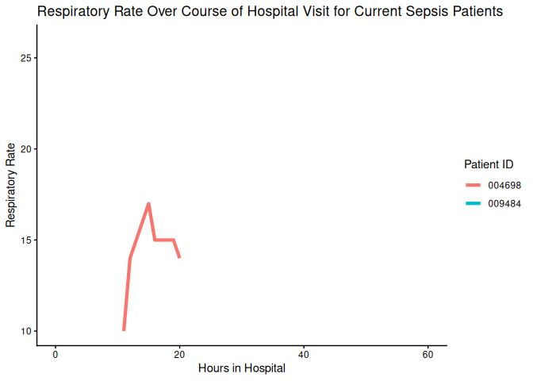

Sepsis Data Report
================

## Sepsis Patient Information

### Data last updated: 2023-04-09 02:32:17

#### Current Vitals for Patients with Sepsis

<table>
 <thead>
  <tr>
   <th style="text-align:left;"> PatientID </th>
   <th style="text-align:right;"> Hours in Hospital </th>
   <th style="text-align:right;"> Heart Rate </th>
   <th style="text-align:right;"> Temperature </th>
   <th style="text-align:right;"> Respiratory Rate </th>
  </tr>
 </thead>
<tbody>
  <tr>

  </tr>
</tbody>
</table>

#### Change in Vitals for All Patients

<table>
<caption>Change refers to change from last hour</caption>
 <thead>
  <tr>
   <th style="text-align:left;"> PatientID </th>
   <th style="text-align:right;"> Hours in Hospital </th>
   <th style="text-align:left;"> Sepsis </th>
   <th style="text-align:right;"> Heart Rate </th>
   <th style="text-align:right;"> Temperature </th>
   <th style="text-align:right;"> Respiratory Rate </th>
   <th style="text-align:right;"> Heart Rate Change </th>
   <th style="text-align:right;"> Temperature Change </th>
   <th style="text-align:right;"> Respiration Rate Change </th>
  </tr>
 </thead>
<tbody>
  <tr>
   <td style="text-align:left;"> 000313 </td>
   <td style="text-align:right;"> 1 </td>
   <td style="text-align:left;"> No </td>
   <td style="text-align:right;"> 92 </td>
   <td style="text-align:right;"> 37.33 </td>
   <td style="text-align:right;"> 30 </td>
   <td style="text-align:right;"> 6 </td>
   <td style="text-align:right;"> 0.39 </td>
   <td style="text-align:right;"> 6 </td>
  </tr>
  <tr>
   <td style="text-align:left;"> 000335 </td>
   <td style="text-align:right;"> 1 </td>
   <td style="text-align:left;"> No </td>
   <td style="text-align:right;"> NA </td>
   <td style="text-align:right;"> NA </td>
   <td style="text-align:right;"> NA </td>
   <td style="text-align:right;"> NA </td>
   <td style="text-align:right;"> NA </td>
   <td style="text-align:right;"> NA </td>
  </tr>
  <tr>
   <td style="text-align:left;"> 000341 </td>
   <td style="text-align:right;"> 0 </td>
   <td style="text-align:left;"> No </td>
   <td style="text-align:right;"> 91 </td>
   <td style="text-align:right;"> NA </td>
   <td style="text-align:right;"> 19 </td>
   <td style="text-align:right;"> NA </td>
   <td style="text-align:right;"> NA </td>
   <td style="text-align:right;"> NA </td>
  </tr>
  <tr>
   <td style="text-align:left;"> 000470 </td>
   <td style="text-align:right;"> 1 </td>
   <td style="text-align:left;"> No </td>
   <td style="text-align:right;"> 85 </td>
   <td style="text-align:right;"> 36.89 </td>
   <td style="text-align:right;"> 15 </td>
   <td style="text-align:right;"> 21 </td>
   <td style="text-align:right;"> NA </td>
   <td style="text-align:right;"> 5 </td>
  </tr>
  <tr>
   <td style="text-align:left;"> 000534 </td>
   <td style="text-align:right;"> 4 </td>
   <td style="text-align:left;"> No </td>
   <td style="text-align:right;"> 89 </td>
   <td style="text-align:right;"> 36.40 </td>
   <td style="text-align:right;"> 16 </td>
   <td style="text-align:right;"> 1 </td>
   <td style="text-align:right;"> 0.10 </td>
   <td style="text-align:right;"> 0 </td>
  </tr>
  <tr>
   <td style="text-align:left;"> 000558 </td>
   <td style="text-align:right;"> 1 </td>
   <td style="text-align:left;"> No </td>
   <td style="text-align:right;"> 54 </td>
   <td style="text-align:right;"> 35.56 </td>
   <td style="text-align:right;"> 14 </td>
   <td style="text-align:right;"> -16 </td>
   <td style="text-align:right;"> 0.12 </td>
   <td style="text-align:right;"> -2 </td>
  </tr>
  <tr>
   <td style="text-align:left;"> 000673 </td>
   <td style="text-align:right;"> 0 </td>
   <td style="text-align:left;"> No </td>
   <td style="text-align:right;"> 96 </td>
   <td style="text-align:right;"> 36.56 </td>
   <td style="text-align:right;"> 12 </td>
   <td style="text-align:right;"> NA </td>
   <td style="text-align:right;"> NA </td>
   <td style="text-align:right;"> NA </td>
  </tr>
  <tr>
   <td style="text-align:left;"> 000902 </td>
   <td style="text-align:right;"> 1 </td>
   <td style="text-align:left;"> No </td>
   <td style="text-align:right;"> 80 </td>
   <td style="text-align:right;"> NA </td>
   <td style="text-align:right;"> 19 </td>
   <td style="text-align:right;"> 2 </td>
   <td style="text-align:right;"> NA </td>
   <td style="text-align:right;"> 6 </td>
  </tr>
  <tr>
   <td style="text-align:left;"> 001083 </td>
   <td style="text-align:right;"> 1 </td>
   <td style="text-align:left;"> No </td>
   <td style="text-align:right;"> 71 </td>
   <td style="text-align:right;"> 36.78 </td>
   <td style="text-align:right;"> 12 </td>
   <td style="text-align:right;"> -14 </td>
   <td style="text-align:right;"> 0.00 </td>
   <td style="text-align:right;"> -9 </td>
  </tr>
  <tr>
   <td style="text-align:left;"> 001282 </td>
   <td style="text-align:right;"> 2 </td>
   <td style="text-align:left;"> No </td>
   <td style="text-align:right;"> 105 </td>
   <td style="text-align:right;"> NA </td>
   <td style="text-align:right;"> 22 </td>
   <td style="text-align:right;"> -28 </td>
   <td style="text-align:right;"> NA </td>
   <td style="text-align:right;"> 2 </td>
  </tr>
  <tr>
   <td style="text-align:left;"> 001309 </td>
   <td style="text-align:right;"> 1 </td>
   <td style="text-align:left;"> No </td>
   <td style="text-align:right;"> 97 </td>
   <td style="text-align:right;"> NA </td>
   <td style="text-align:right;"> 14 </td>
   <td style="text-align:right;"> 9 </td>
   <td style="text-align:right;"> NA </td>
   <td style="text-align:right;"> 1 </td>
  </tr>
  <tr>
   <td style="text-align:left;"> 001545 </td>
   <td style="text-align:right;"> 3 </td>
   <td style="text-align:left;"> No </td>
   <td style="text-align:right;"> 96 </td>
   <td style="text-align:right;"> 36.44 </td>
   <td style="text-align:right;"> 17 </td>
   <td style="text-align:right;"> NA </td>
   <td style="text-align:right;"> NA </td>
   <td style="text-align:right;"> NA </td>
  </tr>
  <tr>
   <td style="text-align:left;"> 001749 </td>
   <td style="text-align:right;"> 2 </td>
   <td style="text-align:left;"> No </td>
   <td style="text-align:right;"> 68 </td>
   <td style="text-align:right;"> 35.90 </td>
   <td style="text-align:right;"> 13 </td>
   <td style="text-align:right;"> -2 </td>
   <td style="text-align:right;"> 0.00 </td>
   <td style="text-align:right;"> 1 </td>
  </tr>
  <tr>
   <td style="text-align:left;"> 001772 </td>
   <td style="text-align:right;"> 0 </td>
   <td style="text-align:left;"> No </td>
   <td style="text-align:right;"> 101 </td>
   <td style="text-align:right;"> NA </td>
   <td style="text-align:right;"> 14 </td>
   <td style="text-align:right;"> NA </td>
   <td style="text-align:right;"> NA </td>
   <td style="text-align:right;"> NA </td>
  </tr>
  <tr>
   <td style="text-align:left;"> 002006 </td>
   <td style="text-align:right;"> 0 </td>
   <td style="text-align:left;"> No </td>
   <td style="text-align:right;"> 109 </td>
   <td style="text-align:right;"> NA </td>
   <td style="text-align:right;"> 21 </td>
   <td style="text-align:right;"> NA </td>
   <td style="text-align:right;"> NA </td>
   <td style="text-align:right;"> NA </td>
  </tr>
  <tr>
   <td style="text-align:left;"> 002320 </td>
   <td style="text-align:right;"> 2 </td>
   <td style="text-align:left;"> No </td>
   <td style="text-align:right;"> 60 </td>
   <td style="text-align:right;"> NA </td>
   <td style="text-align:right;"> 14 </td>
   <td style="text-align:right;"> 0 </td>
   <td style="text-align:right;"> NA </td>
   <td style="text-align:right;"> 0 </td>
  </tr>
  <tr>
   <td style="text-align:left;"> 002444 </td>
   <td style="text-align:right;"> 0 </td>
   <td style="text-align:left;"> No </td>
   <td style="text-align:right;"> 70 </td>
   <td style="text-align:right;"> NA </td>
   <td style="text-align:right;"> 20 </td>
   <td style="text-align:right;"> NA </td>
   <td style="text-align:right;"> NA </td>
   <td style="text-align:right;"> NA </td>
  </tr>
  <tr>
   <td style="text-align:left;"> 002484 </td>
   <td style="text-align:right;"> 3 </td>
   <td style="text-align:left;"> No </td>
   <td style="text-align:right;"> 80 </td>
   <td style="text-align:right;"> NA </td>
   <td style="text-align:right;"> 16 </td>
   <td style="text-align:right;"> 36 </td>
   <td style="text-align:right;"> NA </td>
   <td style="text-align:right;"> 0 </td>
  </tr>
  <tr>
   <td style="text-align:left;"> 003032 </td>
   <td style="text-align:right;"> 2 </td>
   <td style="text-align:left;"> No </td>
   <td style="text-align:right;"> 83 </td>
   <td style="text-align:right;"> NA </td>
   <td style="text-align:right;"> 28 </td>
   <td style="text-align:right;"> -1 </td>
   <td style="text-align:right;"> NA </td>
   <td style="text-align:right;"> 12 </td>
  </tr>
  <tr>
   <td style="text-align:left;"> 003371 </td>
   <td style="text-align:right;"> 0 </td>
   <td style="text-align:left;"> No </td>
   <td style="text-align:right;"> 94 </td>
   <td style="text-align:right;"> NA </td>
   <td style="text-align:right;"> 22 </td>
   <td style="text-align:right;"> NA </td>
   <td style="text-align:right;"> NA </td>
   <td style="text-align:right;"> NA </td>
  </tr>
  <tr>
   <td style="text-align:left;"> 003531 </td>
   <td style="text-align:right;"> 1 </td>
   <td style="text-align:left;"> No </td>
   <td style="text-align:right;"> 80 </td>
   <td style="text-align:right;"> NA </td>
   <td style="text-align:right;"> 16 </td>
   <td style="text-align:right;"> -1 </td>
   <td style="text-align:right;"> NA </td>
   <td style="text-align:right;"> 4 </td>
  </tr>
  <tr>
   <td style="text-align:left;"> 003535 </td>
   <td style="text-align:right;"> 1 </td>
   <td style="text-align:left;"> No </td>
   <td style="text-align:right;"> 80 </td>
   <td style="text-align:right;"> 36.83 </td>
   <td style="text-align:right;"> 23 </td>
   <td style="text-align:right;"> -7 </td>
   <td style="text-align:right;"> NA </td>
   <td style="text-align:right;"> 6 </td>
  </tr>
  <tr>
   <td style="text-align:left;"> 003588 </td>
   <td style="text-align:right;"> 0 </td>
   <td style="text-align:left;"> No </td>
   <td style="text-align:right;"> 98 </td>
   <td style="text-align:right;"> 36.50 </td>
   <td style="text-align:right;"> 25 </td>
   <td style="text-align:right;"> NA </td>
   <td style="text-align:right;"> NA </td>
   <td style="text-align:right;"> NA </td>
  </tr>
  <tr>
   <td style="text-align:left;"> 004104 </td>
   <td style="text-align:right;"> 3 </td>
   <td style="text-align:left;"> No </td>
   <td style="text-align:right;"> 88 </td>
   <td style="text-align:right;"> NA </td>
   <td style="text-align:right;"> 18 </td>
   <td style="text-align:right;"> -4 </td>
   <td style="text-align:right;"> NA </td>
   <td style="text-align:right;"> -2 </td>
  </tr>
  <tr>
   <td style="text-align:left;"> 004125 </td>
   <td style="text-align:right;"> 0 </td>
   <td style="text-align:left;"> No </td>
   <td style="text-align:right;"> 84 </td>
   <td style="text-align:right;"> 35.40 </td>
   <td style="text-align:right;"> 20 </td>
   <td style="text-align:right;"> NA </td>
   <td style="text-align:right;"> NA </td>
   <td style="text-align:right;"> NA </td>
  </tr>
  <tr>
   <td style="text-align:left;"> 004250 </td>
   <td style="text-align:right;"> 2 </td>
   <td style="text-align:left;"> No </td>
   <td style="text-align:right;"> 65 </td>
   <td style="text-align:right;"> NA </td>
   <td style="text-align:right;"> 22 </td>
   <td style="text-align:right;"> -4 </td>
   <td style="text-align:right;"> NA </td>
   <td style="text-align:right;"> 0 </td>
  </tr>
  <tr>
   <td style="text-align:left;"> 004459 </td>
   <td style="text-align:right;"> 3 </td>
   <td style="text-align:left;"> No </td>
   <td style="text-align:right;"> 97 </td>
   <td style="text-align:right;"> NA </td>
   <td style="text-align:right;"> 22 </td>
   <td style="text-align:right;"> -4 </td>
   <td style="text-align:right;"> NA </td>
   <td style="text-align:right;"> 7 </td>
  </tr>
  <tr>
   <td style="text-align:left;"> 004472 </td>
   <td style="text-align:right;"> 2 </td>
   <td style="text-align:left;"> No </td>
   <td style="text-align:right;"> 67 </td>
   <td style="text-align:right;"> NA </td>
   <td style="text-align:right;"> NA </td>
   <td style="text-align:right;"> -6 </td>
   <td style="text-align:right;"> NA </td>
   <td style="text-align:right;"> NA </td>
  </tr>
  <tr>
   <td style="text-align:left;"> 004474 </td>
   <td style="text-align:right;"> 1 </td>
   <td style="text-align:left;"> No </td>
   <td style="text-align:right;"> 84 </td>
   <td style="text-align:right;"> NA </td>
   <td style="text-align:right;"> 14 </td>
   <td style="text-align:right;"> -4 </td>
   <td style="text-align:right;"> NA </td>
   <td style="text-align:right;"> -1 </td>
  </tr>
  <tr>
   <td style="text-align:left;"> 004698 </td>
   <td style="text-align:right;"> 2 </td>
   <td style="text-align:left;"> No </td>
   <td style="text-align:right;"> 69 </td>
   <td style="text-align:right;"> NA </td>
   <td style="text-align:right;"> 12 </td>
   <td style="text-align:right;"> 0 </td>
   <td style="text-align:right;"> NA </td>
   <td style="text-align:right;"> -1 </td>
  </tr>
  <tr>
   <td style="text-align:left;"> 005682 </td>
   <td style="text-align:right;"> 5 </td>
   <td style="text-align:left;"> No </td>
   <td style="text-align:right;"> 82 </td>
   <td style="text-align:right;"> NA </td>
   <td style="text-align:right;"> 14 </td>
   <td style="text-align:right;"> -5 </td>
   <td style="text-align:right;"> NA </td>
   <td style="text-align:right;"> 0 </td>
  </tr>
  <tr>
   <td style="text-align:left;"> 006449 </td>
   <td style="text-align:right;"> 2 </td>
   <td style="text-align:left;"> No </td>
   <td style="text-align:right;"> 58 </td>
   <td style="text-align:right;"> NA </td>
   <td style="text-align:right;"> 13 </td>
   <td style="text-align:right;"> -1 </td>
   <td style="text-align:right;"> NA </td>
   <td style="text-align:right;"> -1 </td>
  </tr>
  <tr>
   <td style="text-align:left;"> 006725 </td>
   <td style="text-align:right;"> 0 </td>
   <td style="text-align:left;"> No </td>
   <td style="text-align:right;"> 60 </td>
   <td style="text-align:right;"> 36.67 </td>
   <td style="text-align:right;"> 20 </td>
   <td style="text-align:right;"> NA </td>
   <td style="text-align:right;"> NA </td>
   <td style="text-align:right;"> NA </td>
  </tr>
  <tr>
   <td style="text-align:left;"> 006750 </td>
   <td style="text-align:right;"> 2 </td>
   <td style="text-align:left;"> No </td>
   <td style="text-align:right;"> 101 </td>
   <td style="text-align:right;"> 38.70 </td>
   <td style="text-align:right;"> 14 </td>
   <td style="text-align:right;"> -5 </td>
   <td style="text-align:right;"> 0.45 </td>
   <td style="text-align:right;"> -2 </td>
  </tr>
  <tr>
   <td style="text-align:left;"> 006876 </td>
   <td style="text-align:right;"> 1 </td>
   <td style="text-align:left;"> No </td>
   <td style="text-align:right;"> 88 </td>
   <td style="text-align:right;"> NA </td>
   <td style="text-align:right;"> 24 </td>
   <td style="text-align:right;"> -4 </td>
   <td style="text-align:right;"> NA </td>
   <td style="text-align:right;"> 0 </td>
  </tr>
  <tr>
   <td style="text-align:left;"> 006963 </td>
   <td style="text-align:right;"> 4 </td>
   <td style="text-align:left;"> No </td>
   <td style="text-align:right;"> 73 </td>
   <td style="text-align:right;"> NA </td>
   <td style="text-align:right;"> 22 </td>
   <td style="text-align:right;"> -11 </td>
   <td style="text-align:right;"> NA </td>
   <td style="text-align:right;"> -20 </td>
  </tr>
  <tr>
   <td style="text-align:left;"> 007058 </td>
   <td style="text-align:right;"> 1 </td>
   <td style="text-align:left;"> No </td>
   <td style="text-align:right;"> 79 </td>
   <td style="text-align:right;"> NA </td>
   <td style="text-align:right;"> 26 </td>
   <td style="text-align:right;"> 2 </td>
   <td style="text-align:right;"> NA </td>
   <td style="text-align:right;"> 2 </td>
  </tr>
  <tr>
   <td style="text-align:left;"> 007200 </td>
   <td style="text-align:right;"> 3 </td>
   <td style="text-align:left;"> No </td>
   <td style="text-align:right;"> 96 </td>
   <td style="text-align:right;"> 35.90 </td>
   <td style="text-align:right;"> 12 </td>
   <td style="text-align:right;"> NA </td>
   <td style="text-align:right;"> NA </td>
   <td style="text-align:right;"> NA </td>
  </tr>
  <tr>
   <td style="text-align:left;"> 007350 </td>
   <td style="text-align:right;"> 1 </td>
   <td style="text-align:left;"> No </td>
   <td style="text-align:right;"> 85 </td>
   <td style="text-align:right;"> NA </td>
   <td style="text-align:right;"> 18 </td>
   <td style="text-align:right;"> -15 </td>
   <td style="text-align:right;"> NA </td>
   <td style="text-align:right;"> -1 </td>
  </tr>
  <tr>
   <td style="text-align:left;"> 007996 </td>
   <td style="text-align:right;"> 3 </td>
   <td style="text-align:left;"> No </td>
   <td style="text-align:right;"> 87 </td>
   <td style="text-align:right;"> 38.70 </td>
   <td style="text-align:right;"> 19 </td>
   <td style="text-align:right;"> -1 </td>
   <td style="text-align:right;"> -0.20 </td>
   <td style="text-align:right;"> -2 </td>
  </tr>
  <tr>
   <td style="text-align:left;"> 008242 </td>
   <td style="text-align:right;"> 1 </td>
   <td style="text-align:left;"> No </td>
   <td style="text-align:right;"> 80 </td>
   <td style="text-align:right;"> NA </td>
   <td style="text-align:right;"> 22 </td>
   <td style="text-align:right;"> 0 </td>
   <td style="text-align:right;"> NA </td>
   <td style="text-align:right;"> 1 </td>
  </tr>
  <tr>
   <td style="text-align:left;"> 008356 </td>
   <td style="text-align:right;"> 2 </td>
   <td style="text-align:left;"> No </td>
   <td style="text-align:right;"> 86 </td>
   <td style="text-align:right;"> NA </td>
   <td style="text-align:right;"> 14 </td>
   <td style="text-align:right;"> -4 </td>
   <td style="text-align:right;"> NA </td>
   <td style="text-align:right;"> -2 </td>
  </tr>
  <tr>
   <td style="text-align:left;"> 008409 </td>
   <td style="text-align:right;"> 1 </td>
   <td style="text-align:left;"> No </td>
   <td style="text-align:right;"> 91 </td>
   <td style="text-align:right;"> NA </td>
   <td style="text-align:right;"> NA </td>
   <td style="text-align:right;"> -5 </td>
   <td style="text-align:right;"> NA </td>
   <td style="text-align:right;"> NA </td>
  </tr>
  <tr>
   <td style="text-align:left;"> 008596 </td>
   <td style="text-align:right;"> 4 </td>
   <td style="text-align:left;"> No </td>
   <td style="text-align:right;"> 90 </td>
   <td style="text-align:right;"> 37.11 </td>
   <td style="text-align:right;"> 16 </td>
   <td style="text-align:right;"> -3 </td>
   <td style="text-align:right;"> NA </td>
   <td style="text-align:right;"> -2 </td>
  </tr>
  <tr>
   <td style="text-align:left;"> 008943 </td>
   <td style="text-align:right;"> 2 </td>
   <td style="text-align:left;"> No </td>
   <td style="text-align:right;"> 83 </td>
   <td style="text-align:right;"> NA </td>
   <td style="text-align:right;"> 14 </td>
   <td style="text-align:right;"> 3 </td>
   <td style="text-align:right;"> NA </td>
   <td style="text-align:right;"> 0 </td>
  </tr>
  <tr>
   <td style="text-align:left;"> 009151 </td>
   <td style="text-align:right;"> 4 </td>
   <td style="text-align:left;"> No </td>
   <td style="text-align:right;"> NA </td>
   <td style="text-align:right;"> NA </td>
   <td style="text-align:right;"> NA </td>
   <td style="text-align:right;"> NA </td>
   <td style="text-align:right;"> NA </td>
   <td style="text-align:right;"> NA </td>
  </tr>
  <tr>
   <td style="text-align:left;"> 009181 </td>
   <td style="text-align:right;"> 0 </td>
   <td style="text-align:left;"> No </td>
   <td style="text-align:right;"> 75 </td>
   <td style="text-align:right;"> 35.40 </td>
   <td style="text-align:right;"> 12 </td>
   <td style="text-align:right;"> NA </td>
   <td style="text-align:right;"> NA </td>
   <td style="text-align:right;"> NA </td>
  </tr>
  <tr>
   <td style="text-align:left;"> 009484 </td>
   <td style="text-align:right;"> 2 </td>
   <td style="text-align:left;"> No </td>
   <td style="text-align:right;"> 87 </td>
   <td style="text-align:right;"> NA </td>
   <td style="text-align:right;"> 18 </td>
   <td style="text-align:right;"> 4 </td>
   <td style="text-align:right;"> NA </td>
   <td style="text-align:right;"> 1 </td>
  </tr>
  <tr>
   <td style="text-align:left;"> 009702 </td>
   <td style="text-align:right;"> 1 </td>
   <td style="text-align:left;"> No </td>
   <td style="text-align:right;"> 76 </td>
   <td style="text-align:right;"> NA </td>
   <td style="text-align:right;"> 12 </td>
   <td style="text-align:right;"> 1 </td>
   <td style="text-align:right;"> NA </td>
   <td style="text-align:right;"> -5 </td>
  </tr>
  <tr>
   <td style="text-align:left;"> 009774 </td>
   <td style="text-align:right;"> 0 </td>
   <td style="text-align:left;"> No </td>
   <td style="text-align:right;"> 112 </td>
   <td style="text-align:right;"> NA </td>
   <td style="text-align:right;"> 16 </td>
   <td style="text-align:right;"> NA </td>
   <td style="text-align:right;"> NA </td>
   <td style="text-align:right;"> NA </td>
  </tr>
</tbody>
</table>

